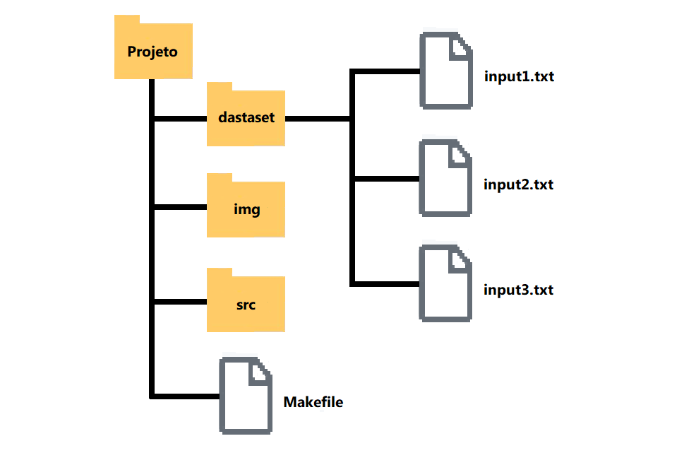
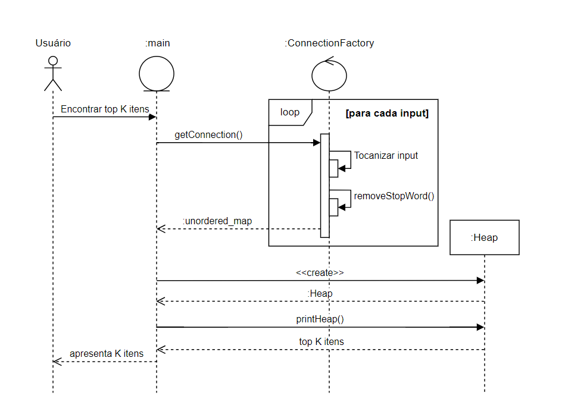

 <section>   
    <h1>📢 AEDS: Top K itens</h1>   
    

        Criado em Agosto de 2023, o projeto <strong>Top K itens</strong> foi desenvolvido em virtude de atender as demandas do curso de Algoritimo e Estrutura de Dados II, ministrado pelo professor <a href="https://www.linkedin.com/in/michelpiressilva/?originalSubdomain=br" target="_blank">Michel Pires Da Silva</a> no Centro Federal de Educação Tecnológica de Minas Gerais (<a href="https://www.divinopolis.cefetmg.br/" target="_blank">CEFET-MG</a>).
    

</section>
<section>
    <h2>🛠 Problemática</h2>
    

        O problema dos top <i>K</i> itens consite em descobrir os elemtentos mais valiosos de uma coleção de dados. Nesse projeto, essa discução é empregada com o objetivo de encontrar as <i>K</i> palavras mais significativas em um conjunto de textos, sendo <i>K</i> número de palavras a serem consideradas. Assim dizendo, a relevânvia de cada elemento é avaliada de acordo com a quantidade de vezes em que aparece nos dados.  
    

    

            É importante ressaltar que a coleção de arquivos passada como entrada devem conter textos sem nenhuma formatação ("arquivo ASCII") onde cada palavra é vista como uma sequência de letras delimitada por espaço em branco, “coluna da esquerda”, “coluna da direita” e símbolos de pontuação (".","?", "!", etc).
    

<section>
<section>
    <h2>📩 Arquivos</h2>
    

        Para que o programa de computador apresente uma conduta uniforme para todos os usuarios, foi estabelecido regras para organizar a entrada de dados. Por conseguinte, todos os arquivos tem de ser .txt, ou seja, arquivos de texto que não contém formatação. Além disso, os arquivos devem possuir a nomeclartura especifica, na qual seus nome precisam ser definidos como “input<i>N</i>”, em que <i>N</i> é a ordem de entrada. Observe a Figura 1 para melhor entendimento.
    

    

        
          <strong>Figura 2:</strong> Exemplo de como inserir arquivos de entrada
    

     
    

        Ademais, é necessário que todos os arquivos sejam armazenados dentro da pasta <i>./dataset</i>. Por ultimo, para realizar a inserção de dados é necessario modificar a constante <i>FILES</i>, definida na linha 8 do <a href="https://github.com/LuanLuL/AEDS---Top_K_Itens/blob/main/src/main.cpp" target="_blank">main.cpp</a>; o valor de <i>FILES</i> deve ser igual a quantidade de inputs presentes. 
    

    <b>OBSERVAÇÃO:</B> Não exlua ou altere o nome do arquivo "stopwords.txt".
</section>
<section>
    <h2>♟ Implementação</h2>
    

        A questão apresentada nesse repositório é um exemplo clássico que pode ser solucionado utilizando-se hash e heap. Nesse sentido, utiliza-se o hash para contar a frequência de todos os itens, enquanto o heap se aplica na manutenção de uma lista dos <i>K</i> itens de maior valor.
    

    <ul>
        <li>
            

                <h3>Hash</h3>
                

                    As tabelas de dispersão ou tabelas hash, são estruturas projetadas para otimizar operações de busca por meio de indexação. Nessas tabelas, uma função de transformação é empregada para processar cada elemento de entrada, gerando assim uma chave correspondente. Essa chave é então usada para determinar a posição onde o elemento será armazenado na tabela.
                

                

                    De forma geral, essa função hash é representada como <i>f( xy ) = [1, . . ., T]</i>, em que um subconjunto do conjunto de entrada, com tamanho <i>T</i>, é mapeado para a posição <i>xy</i> na tabela. É importante notar que existem várias maneiras de implementar essa função, tais como o método do resto da divisão, método do meio do quadrado, e entre outros.
                

                

                    Neste projeto, a estutura de tabela hash escolhida foi a classe <a href="https://cplusplus.com/reference/unordered_map/unordered_map/" target="_blank"> std::unordered_map</a> da biblioteca padrão C++, a qual é uma boa opção para grandes conjuntos de dados em que a ordem de inserção não faz diferença. Apensar de ser uma estrtura simples de usar, suas funções podem variar de acordo com o compilador utilizado.
                

                

                    No caso do GCC (compilador empregado nesse sistema), o unordered_map é considerado uma hash aberta, cuja a função de transformação é uma técnica chamada "hash combinado" que envolve a aplicação de uma série de operações de mistura (bitwise XOR, shift e multiplicação) para espalhar bem os bits da chave original e minimizar as chances de colisões.
                

                

                    Enfim, com as condições adequadas ao conjunto de dados, o custo de uma tabela hash pode alcançar tempos de <b><i>θ( 1 )</i></b>, o qual se refere ao melhor tempo de execução/melhor caso. Em um caso médio teremos algo próximo de <b><i>θ( 1+N / T )</i></b> e no pior caso <b><i>θ( n )</i></b>.
                

            

        </li>
        <li>
            

                <h3>Heap</h3>
                

                    A heap é um tipo abstrato de dados conhecido como fila de prioridades que armazena os elementos, cada um associado a uma determinada precedência. Esse modelo torna-se interessante para o projeto por possuir a particularidade de prover um acesso rápido ao elemento com a maior (ou menor) prioridade.
                

                

                    Uma heap é frequentemente representada por um vetor (ou array) que simula uma árvore binária completa e ordenada. Dessa maneira, o primeiro elemento no vetor é sempre a raiz da árvore e cada nó pai tem dois nós filhos. Por exemplo, se o nó pai está no índice i, seus filhos estão nos índices <i>2 * i + 1</i> (filho esquerdo) e <i>2 * i + 2</i> (filho direito).
                

                

                    O tipo heap adotado nesse sistema é apresentado como Max Heap (Heap Máximo): A principal característica dessa heap é que o valor de cada nó é maior ou igual ao valor de seus filhos. Isso significa que o elemento de maior prioridade sempre está no topo da heap.
                

                

                    Em ultima análise, a propriedade fundamental de uma heap é que ela mantém essa ordenação parcial durante todas as operações de inserção e remoção. Isso permite que as operações de sejam eficientes, geralmente executadas em tempo <b><i>θ(log n)</i></b>, onde n é o número de elementos na heap.
                

            

        </li>
    </ul>
    

        Com um entendimento das principais estruturas de dados frequentemente empregadas para abordar a problemática, foi possível elaborar uma estratégia que otimiza o tempo computacional. No entanto, essa abordagem resulta em uma demanda substancial por armazenamento em memória, representando um compromisso entre a eficiência do processamento e a utilização elevada de recursos de memória. Observe a tática implementada na Figura 2.
    

    

        
          <strong>Figura 2:</strong> Diagrama de sequência do sistema top K itens
        

    

        A estratégia se fundamenta em um objeto de acesso aos dados (DAO), representado pela classe <code>ConnectionFactory</code>. Esse objeto tem a responsabilidade de executar todas as ações associadas aos dados de entrada. O propósito central do DAO é estabelecer uma tabela de dispersão (hash) para computar a frequência de cada palavra de conteúdo tokenizada na coleção de informações de entrada.
    

    

        Ao dispor de um conjunto completo de palavras, juntamente com suas respectivas frequências de ocorrência nos inputs, uma abordagem eficaz para a identificação dos K itens mais relevantes consiste em armazenar essas informações em uma Max Heap. Nessa estrutura, a prioridade é estabelecida com base no número de ocorrências das palavras, possibilitando uma recuperação eficaz dos itens mais frequentes.
    

    

        Sendo assim, é criada uma heap para acomodar elementos do tipo <code>pair(string, int)</code>, em que <code>pair.first</code> representa a palavra e <code>pair.second</code> denota a frequência associada a cada palavra. Com base nisso, a questão é solucionada, visto que podemos empregar as propriedades da heap para localizar os itens de maior prioridade.
    

    

        Portanto, a Max Heap surge como uma ferramenta crucial na consecução desse objetivo. No entanto, é importante ressaltar que essa estratégia pode consumir uma quantidade significativa de memória, pois a heap irá conter todas as palavras de conteúdo presentes nos inputs de entrada.
    
   
</section>
<section>
    <h2>🎞 Processamento</h2>
     

        Durante o deselvovimento do algoritimo apresentado nesse repositório, foi-se utilizado de duas principais tecnologias: Visual Studio Code e WSL:Ubunto.
    

    <ul>
        <li>    
            

                O Visual Studio Code é um editor de texto multiplataforma disponibilizado pela Microsoft para o desenvolvimento de aplicações, Conhecer essa ferramenta é importante para os desenvolvedores que pretendem trabalhar em ambientes multiplataforma, por exemplo,  podendo operar o desenvolvimento em ambiente Mac e Linux, ao mesmo tempo em que mantém o projeto compatível com Windows. Segue em anexo o link para o site da plataforma — <a href="https://code.visualstudio.com/" target="_blank">Visual Studio Code</a>.
            

        </li>
        <li>
            
O WSL é um método para se executar o Sistema Operaciona Linux dentro do Windows de forma muito facil. Essa platoforma se torna essencial para o desenvovimento em ambiente GNU Linux, evitando tarefas como a intalação de maquinas vituais, criação de dual booting no computador pessoal e entre outras coisas. Além disso, existem diversas vantagens como rodar programas em conjunto e compartihamento de localhost. Segue em anexo um  tutorial de download do WSL2 — <a href="https://youtu.be/hd6lxt5iVsg" target="_blank">Tutorial WSL2</a>.

        </li>
    </ul>
    

        O programa ainda possui um arquivo Makefile que realiza todo o procedimento de compilação e execução. Para tanto, temos as seguintes diretrizes de execução:
    

    

        <table>
            <thead>
                <tr>
                    <th>Comando</th>
                    <th>Função</th>
                </tr>
            </thead>
            <tbody>
                <tr>
                    <td><code>make clean</code></td>
                    <td>Apaga a última compilação realizada contida na pasta build</td>
                </tr>
                <tr>
                    <td><code>make</code></td>
                    <td>Executa a compilação do programa utilizando o gcc, e o resultado vai para a pasta build</td>
                </tr>
                <tr>
                    <td><code>make run</code></td>
                    <td>Executa o programa da pasta build após a realização da compilação</td>
                </tr>
            </tbody>
        </table>
        

            <b>Tabela 1:</b> Comandos úteis para compilar e executar o programa de computador
        

    

    

</section>
<section>
    <h2>🙌 Resultado Final</h2>
    

        Diante do exposto, é evidente que o programa de computador delineado neste repositório tem a capacidade de identificar as top K palavras mais frequentes. Conforme ilustrado no diagrama de sequência na Figura 2, os principais métodos do algoritmo contribuem, em média, para um custo assintótico expresso como:
        

            <i><strong>I × (T + n x S)</i>,</strong>
        

        onde <i>I</i> corresponde ao número de inputs de entrada, <i>T</i> representa o custo associado à tokenização do arquivo de entrada e <i>(n x S)</i> indica o tempo necessário para verificar se uma palavra é uma stopword, sendo <i>S</i> a quantidade de stopwords. Além disso, deve ser somado custo linear de criar a Max Heap.
    

    

        Tendo <i>K = 20</i>, é possivel visualizar logo abaixo o resultado alcançado a partir das entradas presentes no <a href="https://github.com/LuanLuL/AEDS---Top_K_Itens/tree/main/dataset">conjunto teste de dados</a> disponibilizado:
        <pre>
---------- TOP 20 itens ----------
    0       WORD\FREQUENCY
    1       ainda\768
    2       assim\610
    3       tudo\753
    4       aqui\508
    5       pode\606
    6       vez\500
    7       homem\537
    8       duas\299
    9       outros\495
    10      tempo\495
    11      outro\582
    12      dia\476
    13      agora\478
    14      onde\375
    15      bem\450
    16      gente\268
    17      talvez\233
    18      coisa\384
    19      dizer\374
    20      mundo\331
----------------------------------
        </pre>
    

    

        É fundamental destacar que a resposta não segue nenhuma ordem predefinida, consistindo apenas na exibição dos primeiros K elementos da Max Heap. Destaca-se ainda que o  valor de <i>K</i> é definido pelo parametro da função <code>Heap::print(int K)</code>.
    

    

        Portanto, ao examinarmos o desempenho do algoritmo, conclui-se que o custo é primordialmente impactado pela complexidade da tokenização e pela verificação de stopwords. No que se trata à etapa de identificação dos elementos mais frequentes, não há dificuldade associada, uma vez que as propriedades da Max Heap garantem eficazmente esse processo.
    

</section>
<section>
    

    

          

           Feito por <strong>Luan Gonçalves Santos</strong>     
         

         

          
        
        

    

</section>